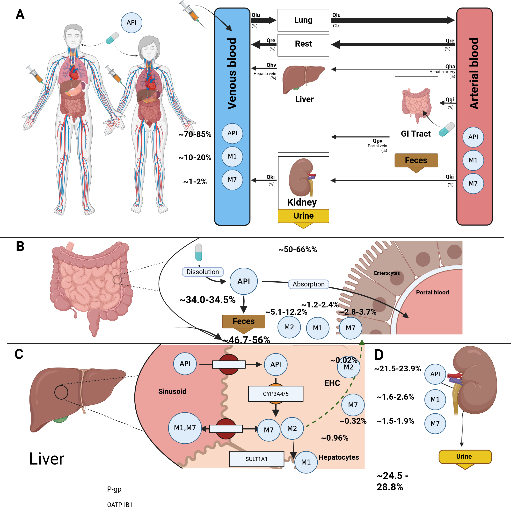

[](https://doi.org/10.5281/zenodo.18877904)
[](https://github.com/matthiaskoenig/apixaban-model/actions/workflows/python.yml)
[](https://github.com/matthiaskoenig/apixaban-model/actions/workflows/docker.yml)

# apixaban model
This repository provides the apixaban physiologically based pharmacokinetics/ pharmacodynamics (PBPK/PD) model.

The model is distributed as [SBML](http://sbml.org) format available from [`apixaban_body_flat.xml`](./models/apixaban_body_flat.xml) with 
corresponding [SBML4humans model report](https://sbml4humans.de/model_url?url=https://raw.githubusercontent.com/matthiaskoenig/apixaban-model/main/models/apixaban_body_flat.xml) and [model equations](./models/apixaban_body_flat.md).

The COMBINE archive is available from [`apixaban_model.omex`](./apixaban_model.omex).



### Comp submodels
* **coagulation** submodel [`apixaban_coagulation.xml`](./models/apixaban_coagulation.xml) with [SBML4humans report](https://sbml4humans.de/model_url?url=https://raw.githubusercontent.com/matthiaskoenig/apixaban-model/main/models/apixaban_coagulation.xml) and [equations](./models/apixaban_coagulation.md).
* **liver** submodel [`apixaban_liver.xml`](./models/apixaban_liver.xml) with [SBML4humans report](https://sbml4humans.de/model_url?url=https://raw.githubusercontent.com/matthiaskoenig/apixaban-model/main/models/apixaban_liver.xml) and [equations](./models/apixaban_liver.md).
* **kidney** submodel [`apixaban_kidney.xml`](./models/apixaban_kidney.xml) with [SBML4humans report](https://sbml4humans.de/model_url?url=https://raw.githubusercontent.com/matthiaskoenig/apixaban-model/main/models/apixaban_kidney.xml) and [equations](./models/apixaban_kidney.md).
* **intestine** submodel [`apixaban_intestine.xml`](./models/apixaban_intestine.xml) with [SBML4humans report](https://sbml4humans.de/model_url?url=https://raw.githubusercontent.com/matthiaskoenig/apixaban-model/main/models/apixaban_intestine.xml) and [equations](./models/apixaban_intestine.md).
* **whole-body** submodel [`apixaban_body.xml`](./models/apixaban_body.xml) with [SBML4humans report](https://sbml4humans.de/model_url?url=https://raw.githubusercontent.com/matthiaskoenig/apixaban-model/main/models/apixaban_body.xml) and [equations](./models/apixaban_body.md).

## How to cite
To cite the model repository

> Myshkina, M., Babaeva, M., Chang, L., Metternich, J., Baton, S., Elias, M., Bedon S. & König, M. (2026).
> *Physiologically based pharmacokinetic/ pharmacodynamic (PBPK/PD) model of apixaban.*   
> Zenodo. [https://doi.org/10.5281/zenodo.18877904](https://doi.org/10.5281/zenodo.18877904)

## License

* Source Code: [MIT](https://opensource.org/license/MIT)
* Documentation: [CC BY-SA 4.0](http://creativecommons.org/licenses/by-sa/4.0/)
* Models: [CC BY-SA 4.0](http://creativecommons.org/licenses/by-sa/4.0/)

This program is distributed in the hope that it will be useful, but WITHOUT ANY
WARRANTY; without even the implied warranty of MERCHANTABILITY or FITNESS FOR A
PARTICULAR PURPOSE.

## Run simulations
### python
Clone the repository 
```bash
git clone https://github.com/matthiaskoenig/apixaban-model.git
cd apixaban-model
```

#### uv
Setup environment with uv (https://docs.astral.sh/uv/getting-started/installation/)
```bash
uv venv
uv sync
```
Run the complete analysis:
```bash
uv run run_apixaban -a all -r results
```

#### pip
If you use pip install the package via
```bash
pip install -e .
```
Run the complete analysis in the environment via:
```bash
run run_apixaban -a all -r results
```

### docker
Simulations can also be run within a docker container:

```bash
docker run -v "${PWD}/results:/results" -it matthiaskoenig/apixaban:latest /bin/bash
```

Run the complete analysis:
```bash
uv run run_apixaban -a all -r /results
```
The results are written into the mounted `/results` folder on the host.

In case of permission issues with the mounted folder, adjust ownership and access rights with:
```bash
sudo chown $(id -u):$(id -g) -R "${PWD}/results"
sudo chmod 775 "${PWD}/results"
```

## Funding

Mariia Myshkina was supported by the Federal Ministry of Education and Research (BMBF, Germany) within ATLAS by grant number 031L0304B and by the German Research Foundation (DFG) within Priority Programme SPP 2311 by grant number 465194077 (Subproject SimLivA).
Matthias König was supported by the Federal Ministry of Research, Technology and Space (BMFTR, Germany) within ATLAS by grant number 031L0304B and by the German Research Foundation (DFG) within the Research Unit Program FOR 5151 QuaLiPerF (Quantifying Liver Perfusion-Function Relationship in Complex Resection - A Systems Medicine Approach) by grant number 436883643 and by grant number 465194077 (Priority Programme SPP 2311, Subproject SimLivA). This work was supported by the BMBF-funded de.NBI Cloud within the German Network for Bioinformatics Infrastructure (de.NBI) (031A537B, 031A533A, 031A538A, 031A533B, 031A535A, 031A537C, 031A534A, 031A532B). 

© 2025-2026 Mariia Myshkina and Matthias König, [Systems Medicine of the Liver](https://livermetabolism.com)
